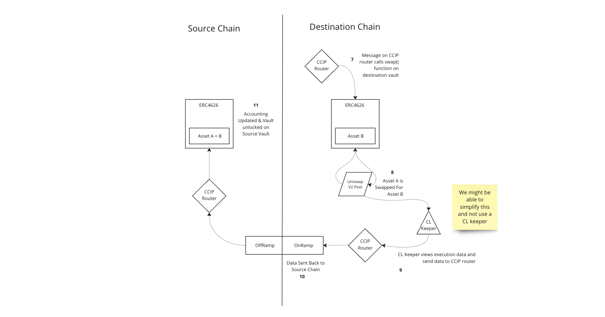

# Spec Doc for CL Vault

## Abstract
Interacting with bridges is challenging and imposes a cost and time commitment on the user that is a sub-standard experience relative to traditional asset management
## Motivation
### Feature
- **Description**: An ERC4626 vault that can execute bridging and investments on behalf of the user, using CCIP as the underlying messaging protocol.

### Why is this feature necessary?
- To make yield opportunities available to users on their preferred chain.

### Who is this feature for?
- **Managers**: Create vaults that include a more diverse set of assets and strategies.
- **Investors**: Improved UI for allocating to opportunities beyond your preferred chain.

### When and how is this feature going to be used?
- Used anytime a manager wants to abstract away cross-chain interactions from their users.

### User Story
Sandra has all of her funds on Base. She is a new DeFi user and just got a metamask account. She has heard about good yield on Avalanche AVAX, but is unsure about bridges and the idea of multiple wallets and chains.

X-Chain Yield Vaults provide a way that she can easily deposit collateral into her preferred chain, and on the backend it handles all of the bridging for her. For example, she deposits ETH on Base and receives a share token that represents her claim on Staked AVAX on Avalanche.

## Background Information

### ERC4626
ERC4626 is the standardized vault contract used for accounting and managing user withdrawals and deposits. 

#### Examples & Contracts:
- [Solmate](https://github.com/transmissions11/solmate/blob/main/src/mixins/ERC4626.sol)
- [Open Zeppelin](https://github.com/OpenZeppelin/openzeppelin-contracts/blob/master/contracts/token/ERC20/extensions/ERC4626.sol)
- A simple implementation on [QuickNode](https://www.quicknode.com/guides/ethereum-development/smart-contracts/how-to-use-erc-4626-with-your-smart-contract#what-you-will-need)
- Smart Contract Programmer [Vault Math](https://youtu.be/k7WNibJOBXE?si=kwVLuDNLKkWEQ1cc)

#### Accounting:
- **Deposit Asset**: Use CCIP-BnM on source chain as Asset A. All the vault accounting on the source chain will be in this asset
- **Yield Asset**: Use (Create an ERC20) on destination chain as Asset B. _Question: should the vault on the destination chain be in this asset or Asset A?_
- **Total Assets Calculation**: `totalAssets()` is defined in wAVAX according to the total of both and exchange rate between them.
- **Fetching Timestamp**: Call `historicalExchangeRateTimestamps(0)` to get `_timestamp`.
- **Getting Exchange Rate**: Call `historicalExchangeRateByTimestamps(_timestamp)` to get rate in wei.
- **Handling Execution Data**:
  - The challenge is obtaining execution data on swaps (slippage) and exchange rate back to the vault contracts on the destination chain to ensure the `totalAssets()` call is accurate.
  - Use CCIP for this purpose.
- **Keeper Role**:
  - A keeper grabs the exchange rate and execution data from the swap and returns it to the destination chain using CCIP.
  - Keeper on homechain executes a function to update `totalAssets()` based on this data.
- **Redemption Process**:
  - User shares on redeem are defined as their percentage of `totalSupply`.
  - User initiates a redeem call.
  - Calculate `user_withdrawal_perc = number of shares / totalSupply()`.
  - Determine the amount to transfer out: `amount to transfer out = user_withdrawal_perc * totalAssets()`.

### Chainlink Automation
- **Getting Started**: [Guide](https://docs.chain.link/chainlink-automation/overview/getting-started)
- **Better Guide**: [Time-based upkeeps](https://docs.chain.link/quickstarts/time-based-upkeep)
  - Time-based upkeeps are smart contracts set up using Chainlink Automation
      - Allow the automatic execution of a smart contract function on a custom schedule
      - Similar to cron jobs
      - Can be used to trigger smart contract functions.
  - Register a new upkeep on [automation.chain.link](automation.chain.link).
  - Use a cron expression to set the time interval. For example, `0 0 * * *` runs at midnight every 24 hours.
  - Consider setting upkeep to call some bridge function on the vault smart contract.
- **Custom Logic**: 
  - Import the right Chainlink libraries to set custom logic within your smart contract.
  - For Example, topping up a contract when the balance falls too low
  - Guide on Chainlink keeper: [CL Keeper - Guide](https://docs.chain.link/chainlink-automation/guides/compatible-contracts)
- **Log-based Automation**:
    - Chainlink Automation offers a feature called Log Trigger Upkeep, which allows you to monitor specific events like deposits on a vault and trigger actions based on them. This feature is useful for automating responses to on-chain events without continuous manual monitoring.

    - To use this, you need to implement the ILogAutomation interface in your smart contract. This involves defining functions like checkLog and performUpkeep. checkLog is used to parse log data and check if an on-chain action is needed, while performUpkeep executes the necessary on-chain actions.

    - You can deploy a contract with this interface, such as CountWithLog, which uses events to trigger actions. Then, you can register your contract with Chainlink Automation, specifying the details and conditions under which your contract should react to logs. Once set up, Chainlink Automation will monitor the logs and execute your contract's functions when the specified conditions are met.

    - For detailed steps and examples, you can refer to the specific Chainlink documentation or guides available online. This feature streamlines processes for smart contracts, making them more responsive and efficient.

### Chainlink CCIP
- Install Foundry Chainlink Toolkit: `forge install smartcontractkit/foundry-chainlink-toolkit`
- Supported [Testnets](https://docs.chain.link/ccip/supported-networks/testnet)
- **Uniswap V2 [Deployment](https://sepolia.etherscan.io/address/0xC532a74256D3Db42D0Bf7a0400fEFDbad7694008#code)** on Sepolia
- **[CCIP Test Tokens](https://docs.chain.link/ccip/test-tokens#mint-tokens-in-the-documentation)**:
  - **BnM**: These tokens are minted on each testnet. When transferring these tokens between testnet blockchains, CCIP burns the tokens on the source chain and mints them on the destination chain.
  - **LnM**: These tokens are only minted on Ethereum Sepolia. On other testnet blockchains, the token representation is a wrapped/synthetic asset called clCCIP-LnM. When transferring these tokens from Ethereum Sepolia to another testnet, CCIP locks the CCIP-LnM tokens on the source chain and mints the wrapped representation clCCIP-LnM on the destination chain. Between non-Ethereum Sepolia chains, CCIP burns and mints the wrapped representation clCCIP-LnM.
 
EVM2AnyMessage - use this solidity struct to build the CCIP message

| Name         | Type                       | Description                                                                                       |
|--------------|----------------------------|---------------------------------------------------------------------------------------------------|
| receiver     | bytes                      | Receiver address. Use abi.encode(sender) to encode the address to bytes.                          |
| data         | bytes                      | Payload sent within the CCIP message.                                                             |
| tokenAmounts | Client.EVMTokenAmount[]    | Tokens and their amounts in the source chain representation.                                      |
| feeToken     | address                    | Address of feeToken. Set address(0) to pay in native gas tokens such as ETH on Ethereum or MATIC on Polygon. |
| extraArgs    | bytes                      | Users fill in the EVMExtraArgsV1 struct then encode it to bytes using the _argsToBytes function.  |

EVMExtraArgsV1

| Name     | Type    | Description                                                                                              |
|----------|---------|----------------------------------------------------------------------------------------------------------|
| gasLimit | uint256 | Specifies the maximum amount of gas CCIP can consume to execute ccipReceive() on the contract located on the destination blockchain. Read Setting gasLimit for more details. |
| strict   | bool    | Used for strict sequencing. Read Sequencing for more details.                                            |

## Open Questions
- [ ] What assets and what chain to use? Why?
    - *Answer*
- [ ]How will the swap on the destination chain trigger the CCIP message to update the accounting?
      - Does a swap need to update anything? 
        - The whole purpose of accounting is to issue the right amount of shares, so if a new user deposits on the source chain after the above swap, the NAV of the vault will be calculated based on the post swap asset balances. Our goal is to be able to get this value across to the source chain using a function call on the source chain.
      - Should the origin vault also be the sender contract and the destination vault be the reciever contract?
      - OR Should the token transfers be routed via a protocol controlled transfer contract?
      - Also can deposit + bridging be atomic ie in the same transaction? What is the expected latency?
- [ ] What testnet deployments are ruled out by picking specific technologies
    - *For example: Li.Fi is not on Sepolia*
- [ ] Returning execution **data from the swap transaction** on the destination chain: Are we sure that can be handled in the same function call as the swap itself? do we not need to wait for a block so we have something to read from? 
    - *Answer*
- [ ] For withdrawals: Are we sure we want **push instead of pull** for transfering assets to user?
    - pull is safe lets do that
- [ ] How do we enable pull on the source chain vault? How do we keep user funds safer

## Feasibility Analysis
Provide potential solution(s) including the pros and cons of those solutions and who are the different stakeholders in each solution. A recommended solution should be chosen here. A combination of the below solutions will be used for accomplishing the goals of the project.

### Options 
- ~~1. **Bridging Solution A** - Use Li.Fi to bridge, and native destination chain swap~~
- 2. **Bridging Solution B** - Use Chainlink CCIP to send tokens and then use native destination chain swap 
- ~~3. **Custody Solution A** - User Funds on Destination Chain sit in an EOA and cannot be redeemed (one way trip)~~
- 4. **Custody Solution B** - User Funds on Destination Chain are in a seperate vault that users can withdraw from (much more complicated but possible with CCIP I think)
- 5. **Locking Option** - Vault is locked during bridging and swapping sequence to protect against attacks

### High Level Design Plan
The chosen design will use CCIP as the underlying messaging protocol. As there are a limited number of tokens enabled for the protocol to date, CCIP-BnM will be used as Asset A on the source chain vault, and that will be bridged to the Destination Chain Vault. Here is will be swapped to an ERC20 using a Uniswap V2 fork and deposited into another ERC4626.

The vault will be locked during bridging periods to protect from griefing while the value of the underlying is undefined.

## Checkpoint 1
Before more in depth design of the contract flows lets make sure that all the work done to this point has been exhaustive. It should be clear what we're doing, why, and for who. All necessary information on external protocols should be gathered and potential solutions considered. At this point we should be in alignment with product on the non-technical requirements for this feature. It is up to the reviewer to determine whether we move onto the next step.

## Requirements

### Source Vault

#### Expected Functionality
1. Accept user funds via a `deposit()` function.
2. Issue shares to user via `mint()`.
3. To issue shares, we need a method to calculate total value of the destination vault + source vault (if funds ever sit idle in the source vault).
4. We need the ERC20 method which returns `totalSupply`.
5. We need a `transfer()` method (or could keep it non-transferrable).
6. We need a method which can convert users LP token value to underlying asset value.
7. We need a method to invoke a CCIP transfer via relevant router.
8. We need to be able to check the status of the deposit on the destination chain.
9. A `withdraw()` function to accept user withdraw request.
10. A mapping to track if users withdraw request has been fulfilled.
11. A method to burn user shares.
12. A method to `lockVault()`
13. A method to `unlockVault()`

### Destination Vault

#### Expected Functionality
1. Accept a CCIP transfer.
2. Swap funds to target yield asset.
3. Swap funds back to base asset.
4. Return a value of assets in the vault in terms of base asset.
5. Accept a withdrawal request from the source vault.
6. Calls `swap()`.
7. Send a CCIP programmable token transfer as well as the message ID of the initially received message.
8. Swap funds based on the amount of requested funds.

### Deposits & Withdrawals Transaction Flows

##### Deposits & Daily Bridging 1

##### Deposits & Daily Bridging 2

##### Withdrawals 1

##### Withdrawals 2

## Checkpoint 2
Before we spec out the contract(s) in depth we want to make sure that we are aligned on all the technical requirements and flows for contract interaction. Again the who, what, when, why should be clearly illuminated for each flow. It is up to the reviewer to determine whether we move onto the next step.

**Reviewer**:

Reviewer: []
## Specification
### [Contract Name]
#### Inheritance
- List inherited contracts
#### Structs
| Type 	| Name 	| Description 	|
|------	|------	|-------------	|
|address|manager|Address of the manager|
|uint256|iterations|Number of times manager has called contract|  
#### Constants
| Type 	| Name 	| Description 	| Value 	|
|------	|------	|-------------	|-------	|
|uint256|ONE    | The number one| 1       	|
#### Public Variables
| Type 	| Name 	| Description 	|
|------	|------	|-------------	|
|uint256|hodlers|Number of holders of this token|
#### Functions
| Name  | Caller  | Description 	|
|------	|------	|-------------	|
|startRebalance|Manager|Set rebalance parameters|
|rebalance|Trader|Rebalance SetToken|
|ripcord|EOA|Recenter leverage ratio|
#### Modifiers
> onlyManager(SetToken _setToken)
#### Functions
> issue(SetToken _setToken, uint256 quantity) external
- Pseudo code
## Checkpoint 3
Before we move onto the implementation phase we want to make sure that we are aligned on the spec. All contracts should be specced out, their state and external function signatures should be defined. For more complex contracts, internal function definition is preferred in order to align on proper abstractions. Reviewer should take care to make sure that all stake holders (product, app engineering) have their needs met in this stage.

**Reviewer**:

## Implementation
[Link to implementation PR]()
## Documentation
[Link to Documentation on feature]()
## Deployment
[Link to Deployment script PR]()  
[Link to Deploy outputs PR]()

# Additional Research

## Transaction FLows
### CCIP/Messages/Transaction Flow/Functionality Mirror

| Action                                            | Source Action                                                                    | Destination action                                                                                     |
|---------------------------------------------------|----------------------------------------------------------------------------------|-------------------------------------------------------------------------------------------------------|
| User deposits                                     | Deposit()                                                                        | No action                                                                                             |
| Vault mints shares                                | mint()                                                                           | No action                                                                                             |
| totalAssets()                                     | Check for pre-updated value of destination assets, calculate present value in [base asset via Chainlink oracle](https://github.com/smartcontractkit/ccip-defi-lending/blob/c12632b6f1b0954a081e8c658b64ebbd81c4d980/contracts/Protocol.sol#L107) | Should pre-update values after each deposit in the destination asset. Default would be zero.          |
| After mint(), funds sit in the destination vault until bridging event called by CL keeper | A [sendFunds()](https://github.com/smartcontractkit/ccip-defi-lending/blob/c12632b6f1b0954a081e8c658b64ebbd81c4d980/contracts/Sender.sol#L71C17-L71C17) function constructs the message, initializes the router, sends the message, locks the vault and returns the messageId. | *A _ccipRecieve function identifies the message and uses the token amount to call a swap() function   |
|                                                   | A _ccipReceive function identifies the message and uses the received value to update the `totalAssets` on the vault, and call `unlockVault()` | A chainlink keeper uses a [log-based trigger](https://medium.com/@warissara.0039/log-trigger-upkeep-with-chainlink-automation-9d1805a29eda) to view the received tokens from the swap and return that data via CCIP to the source chain. |
| User requests withdraw                            | Withdraw()                                                                       | No action                                                                                             |
| Vault burns the shares, requests for funds from destination | Vault calculates base asset to be requested based on oracle value and on value of deposit asset currently in the source chain vault, burns the shares, records the value of base asset to be requests, user address, [requests for funds via CCIP](https://github.com/smartcontractkit/ccip-liquidation-protector/blob/f0e71131a6171ffe04deeec653b5d5efe9f3713f/contracts/monitors/MonitorCompoundV3.sol#L82) | Destination vault then checks for the amount needed, [swaps to the base token, and sends a CCIP token transfer](https://github.com/smartcontractkit/ccip-liquidation-protector/blob/f0e71131a6171ffe04deeec653b5d5efe9f3713f/contracts/LPSC.sol#L58C20-L58C20) |
| Vault receives funds, completes withdrawal request | __ccipreceive and then return funds to user # Spec Doc for CL Vault

Reference
[ccip-liquidation-protector](https://github.com/smartcontractkit/ccip-liquidation-protector/tree/f0e71131a6171ffe04deeec653b5d5efe9f3713f)

## Unused Protocol Research
### Chainlink Functions
- Call any API from a smart contract: Enables access to off-chain data and computation.
  - [Overview](https://chain.link/functions) and [docs](https://docs.chain.link/chainlink-functions)
  - Good [Video](https://youtu.be/I-g1aaZ3_x4?si=gKw8ccZS5__Kj0mD0) to get up to speed
  - Could be useful for interacting with **Li.Fi API**

### Li.Fi
Li.FI is a multichain bridge and DEX aggregator with support for most chains, bridges, and DEX aggregators as well as single DEXs. List of DEXs they support can be found [here](https://docs.li.fi/list-chains-bridges-dexs). 

* [LiFi Widget](https://docs.li.fi/integrate-li.fi-widget/li.fi-widget-overview) has a set of Prebuilt UI components that will help integrate cross-chain bridging and swapping experince. 

* [LiFi APIs](https://docs.li.fi/li.fi-api/li.fi-api) can be used to transfer tokens, request supported chains and tokens, token information, and all possible connections. You can also request status of transactions via the API. 

* [LiFi SDK](https://docs.li.fi/integrate-li.fi-js-sdk/install-li.fi-sdk) package allows access to Li.Fi API, and find the best cross chain routes on different bridges and exchanges. The routes can then be executed via the SDK.

- **Integration and Functionality Questions**:
  - How will the bridge talk to the smart contract?
  - Noting the challenge that the li.fi API/SDK uses web 2 to get quotes and confirm transactions.
  - Chainlink Automation triggers smart contract functions.
  - Consideration: Maybe use Chainlink Functions (a different CL product) for off-chain logic and interacting with Li.Fi?

- **Li.Fi Testnet Deployments**:
  - Ethereum Goerli
  - Polygon Mumbai

## Design considerations
~~#### 1. Bridging Solution A using CL Functions and Li.Fi API~~
- User deposits asset A to an ERC4626 Vault
- Every 24 hours a Chainlink Function interacts with the LiFi API to RFQ a quote to bridge and swap
    - (this may require a chainlink automation keeper to trigger the call to the Function)
-  The data from quote is passed to a `bridge assets()` function on the vault smart contract as argument and bridge and swap is executed
-  On the destination chain a chainlink keeper watches for the new asset and grabs the execution data for the swap - slippage etc
-  This execution data is passed back to the home chain vault by CCIP
-  This data is then used by a `updateAssets()` function that updates the accouting on the vault

#### 2. Bridging Solution B using CCIP
- Similar to the above but must use `CCIP-BnM` test tokens as deposit asset in vault and requires us to deploy a UNI V2 Pool on Sepolia that pairs the `CCIP-BnM` token against a ERC20 that we deploy
- User deposits token to Vault
- Every 24 hours a CL keeper triggers a bridge and swap using CCIP
- Call data for the swap is sent with the asset
- Swap is executed on Uni pool

~~#### 3. Custody Solution A using a EOA or very simple smart contract~~
- We basically build the bare minimum required to hold the asset and allow the swap once it has been bridged
- Pro: Easier to build and test, faster to deploy
- Con: One way trip for users. They are never getting money back...

#### 4. Custody Solution B using another vault
- We deploy another 4626 on the destination chain that accepts the bridged assets
- When a user wishes to withdraw their money, they burn their shares on the home chain and this creates a CCIP message to the destination chain vault to mint shares for them to withdraw.
- Pro: User can redeem their assets
- Con: Harder to build, more places for accounting to mess up

#### 5. Locking & Security
- As an additional precaution we can create a way to lock the vault when the bridge and swap is being executed
- For Example:
    - We lock the home chain vault (no deposits, withdrawals, mint, redeems etc) with the same CL keeper command that executes the bridge and swap
    - Once the swap has been executed on the destination chain, we can send a call back to the source chain to unlock the vault
